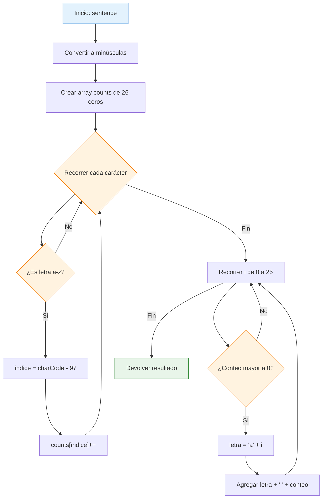
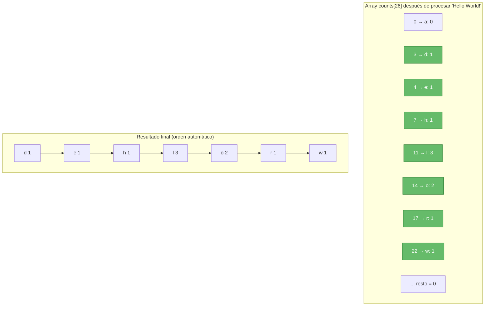

# Character Count

## Enunciado del Problema

Dado un string que contiene una oración, devuelve un **array de strings** con el conteo de cada letra presente, en **orden alfabético**.

**Reglas**:

- Mayúsculas y minúsculas cuentan como la misma letra.
- Ignorar espacios, números, puntuación y cualquier carácter no alfabético.
- Solo incluir letras que aparezcan al menos una vez.
- Salida en minúsculas y formato `"letra conteo"` → ejemplo: `"a 5"`

## Solución Óptima (Recomendada)

```javascript
/**
 * Cuenta las letras de una oración (ignorando case, números, espacios y puntuación)
 * y devuelve un array ordenado alfabéticamente con formato "letra conteo".
 *
 * Complejidad: O(n) tiempo → O(1) espacio auxiliar
 *
 * @param {string} sentence
 * @returns {string[]}
 */
function countCharacters(sentence) {
  // Array fijo de 26 posiciones: índice 0 = 'a', 1 = 'b', ..., 25 = 'z'
  const counts = new Array(26).fill(0);

  // Normalizamos una sola vez
  const lower = sentence.toLowerCase();

  // Fase 1: Contar letras (O(n))
  for (const char of lower) {
    if (char >= "a" && char <= "z") {
      const index = char.charCodeAt(0) - 97; // 'a' → 0
      counts[index]++;
    }
  }

  // Fase 2: Construir resultado (orden natural, O(26) = O(1))
  const result = [];
  for (let i = 0; i < 26; i++) {
    if (counts[i] > 0) {
      const letter = String.fromCharCode(97 + i);
      result.push(`${letter} ${counts[i]}`);
    }
  }

  return result;
}
```

````mermaid

## Diagrama de Flujo



## Diagrama del Array de Conteo (Ejemplo: "Hello World!")



## Análisis de Complejidad

| Métrica          | Complejidad | Explicación                                                   |
|

---------- | ----------- | ------------------------------------------------------------- |
| Tiempo           | **O(n)**    | Un pase por el string + un pase fijo de 26 → O(n + 26) = O(n) |
| Espacio auxiliar | **O(1)**    | Siempre 26 enteros (array fijo)                               |
| Espacio total    | O(k)        | k ≤ 26 (salida) → sigue siendo O(1) en práctica               |

**Ventaja clave**: No se ordena nada → el orden alfabético sale gratis por la estructura del array.

## Casos Edge y Pruebas

| Entrada                                         | Salida Esperada                                                   | Cumple |
| ----------------------------------------------- | ----------------------------------------------------------------- | ------ |
| `""`                                            | `[]`                                                              | Yes    |
| `"!!!123 @#$%"`                                 | `[]`                                                              | Yes    |
| `"a"`                                           | `["a 1"]`                                                         | Yes    |
| `"AAAaaa"`                                      | `["a 6"]`                                                         | Yes    |
| `"The quick brown fox jumps over the lazy dog"` | 26 elementos (pangrama)                                           | Yes    |
| `"JavaScript123!!!"`                            | `["a 2", "c 1", "i 2", "j 1", "p 1", "r 1", "s 1", "t 1", "v 1"]` | Yes    |

## Reflexiones y Aprendizajes

- Cuando el dominio es pequeño y conocido (26 letras), **un array fijo siempre gana** a un HashMap.
- Evitar `.sort()` cuando el orden ya está implícito → mejora dramática de rendimiento.
- Usar `charCodeAt()` y aritmética de índices es una técnica clásica y muy eficiente en problemas de conteo de caracteres.
````
