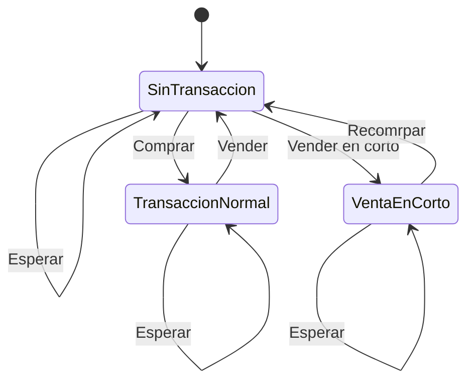

> **Nota importante:**
>
> La primera versión de la solución fue **top-down** (recursiva con memoización), pero la versión final y eficiente es **bottom-up** (tabular, iterativa). El cambio de enfoque se explica en la sección de Reflexiones y Aprendizajes al final de este documento.

#### ¿Usamos bottom-up o top-down en este problema?

En la versión inicial, la solución implementada fue **top-down** (de arriba hacia abajo), identificable porque:

- Usamos una función recursiva que resuelve el problema grande llamando a subproblemas más pequeños.
- Guardamos los resultados de cada subproblema en un mapa (memoización) para no recalcularlos.
- No construimos una tabla iterativamente desde los casos base, sino que la recursión va "bajando" hasta los casos base y luego "sube" resolviendo y guardando los resultados.

**¿Cómo saber si estamos usando top-down o bottom-up?**

- Si tu código es recursivo y usa memoización, es top-down.
- Si tu código usa bucles y una tabla para construir la solución desde los casos base, es bottom-up.

## En este problema, la versión final es bottom-up, ya que permite máxima eficiencia y escalabilidad para los límites grandes del problema. La versión top-down es útil para modelar y entender, pero no es óptima para producción en este caso.


## Best Time To Buy And Sell Stock V - Análisis y Explicación

## Enunciado del Problema

Se te da un array de enteros `prices`, donde `prices[i]` representa el precio de una acción en dólares en el día i, y un entero `k`.

Puedes realizar como máximo `k` transacciones, donde cada transacción puede ser de alguno de los siguientes tipos:

- **Transacción normal:** Comprar en el día i y vender después en el día j (i < j). La ganancia será `prices[j] - prices[i]`.
- **Venta en corto:** Vender en el día i y recomprar después en el día j (i < j). La ganancia en corto es `prices[i] - prices[j]`.

Debes completar cada transacción antes de comenzar otra. Además, no puedes comprar o vender el mismo día en que finalizas una transacción anterior; es decir, cada transacción debe estar completamente cerrada antes de iniciar la siguiente.

Devuelve el máximo beneficio que puedes obtener realizando hasta `k` transacciones.

### restricciones

2 <= prices.length <= 10^3
1 <= prices[i] <= 10^9
1 <= k <= prices.length / 2

### Hints

- Usa Programación Dinámica.
- Mantén los siguientes estados: idx, transactionsDone, transactionType, isTransactionRunning.
- Las transacciones pasan de completadas → en curso y de en curso → completadas.

## Introducción a la Programación Dinámica (DP) y Modelado de Estados

La programación dinámica (DP) es una técnica para resolver problemas complejos dividiéndolos en subproblemas más simples y guardando los resultados para evitar cálculos repetidos. Es especialmente útil cuando:

- El problema se puede descomponer en decisiones secuenciales.
- Hay subproblemas que se repiten (por ejemplo, calcular la serie de Fibonacci guardando los resultados ya calculados).

En este problema, cada día podemos tomar decisiones (comprar, vender, esperar) y el resultado óptimo depende de las decisiones previas. Por eso, DP es la herramienta ideal.

Para aplicar DP aquí, necesitamos definir claramente el "estado" en cada paso. Un estado se describe con:

- **Día actual (`idx`)**: en qué día estamos del array de precios.
- **Transacciones realizadas (`transactionsDone`)**: cuántas transacciones completas llevamos.
- **Tipo de transacción (`transactionType`)**: si estamos en una transacción normal, en una venta en corto (también llamada "posición corta"), o sin ninguna abierta.
- **¿Hay una transacción en curso? (`isTransactionRunning`)**: indica si actualmente tenemos una operación abierta.

> **Nota:** En la literatura y en este documento, "venta en corto" y "posición corta" se usan como sinónimos: ambas refieren a vender primero y recomprar después para obtener ganancia si el precio baja.

**Ejemplo de estado:**
"Estoy en el día 3, ya hice 1 transacción, tengo una venta en corto (posición corta) abierta".

En cada estado, tenemos opciones:

- Esperar (no hacer nada y pasar al siguiente día).
- Iniciar una transacción (si no hay ninguna abierta).
- Cerrar una transacción (si hay una abierta).

La función DP se puede pensar como:

dp(idx, transactionsDone, transactionType, isTransactionRunning)

Donde el resultado es la máxima ganancia posible desde ese estado en adelante.

> Nota: En la práctica, la DP se implementa como una función recursiva con memoización o una tabla multidimensional, donde cada celda representa un estado único.

### ¿Qué es Memoización?

La memoización es una técnica que consiste en guardar los resultados de subproblemas ya resueltos para no volver a calcularlos. Cuando una función DP se llama con los mismos parámetros, simplemente se devuelve el resultado almacenado, acelerando enormemente la solución. Es fundamental en DP recursiva para evitar cálculos redundantes y mejorar la eficiencia.

---

### Ejemplos

**Ejemplo 1:**

Input: prices = [1,7,9,8,2], k = 2

Output: 14

Explicación:
Podemos obtener $14 de ganancia realizando 2 transacciones:

- Una transacción normal: comprar la acción el día 0 por $1 y venderla el día 2 por $9.
- Una venta en corto: vender la acción el día 3 por $8 y recomprarla el día 4 por $2.

**Ejemplo 2:**

Input: prices = [12,16,19,19,8,1,19,13,9], k = 3

Output: 36

Explicación:
Podemos obtener $36 de ganancia realizando 3 transacciones:

- Una transacción normal: comprar la acción el día 0 por $12 y venderla el día 2 por $19.
- Una venta en corto: vender la acción el día 3 por $19 y recomprarla el día 4 por $8.
- Una transacción normal: comprar la acción el día 5 por $1 y venderla el día 6 por $19.

## Estrategia de Resolución

El enfoque que elegimos para este problema es usando Programación Dinámica con modelado explícito de estados. Esto se debe a que:

- Hay múltiples decisiones secuenciales (comprar, vender, esperar, iniciar/cerrar venta en corto) y restricciones sobre cuándo se pueden realizar.
- El número de transacciones está limitado.
- Existen dos tipos de transacción.

La idea es definir una función DP que, dado un estado (día actual, transacciones realizadas, tipo y estado de la transacción), calcule la máxima ganancia posible a futuro. En cada paso, se consideran todas las opciones válidas:

1. **Esperar:** No hacer nada y avanzar al siguiente día.
2. **Iniciar una transacción:** Si no hay ninguna abierta, se puede iniciar una compra o una venta en corto.
3. **Cerrar una transacción:** Si hay una abierta, se puede cerrar (vender si era compra, recomprar si era venta en corto), sumando la ganancia correspondiente y aumentando el contador de transacciones.

La función DP explora todas las combinaciones posibles de estas decisiones, usando memoización para evitar recalcular subproblemas ya resueltos.

Este enfoque garantiza encontrar la solución óptima, ya que considera todas las rutas posibles bajo las restricciones del problema.

### Implementación Paso a Paso

En este problema en lo personal pienso que la clave es avanzar de lo simple a lo complejo. Ahora voy a mostrar el camino que segui para lograr una solucion.

#### 1. Definir la función recursiva

Planteamos una función `dp(idx, transacciones, tipo, enCurso)` que devuelve la máxima ganancia posible desde el estado actual.

#### 2. Casos base

- Si llegamos al final del array o ya hicimos k transacciones, la ganancia es 0.

#### 3. Opciones en cada estado

En cada llamada, según el estado, tenemos opciones:

- **Esperar:** Avanzar al siguiente día sin hacer nada.
- **Iniciar una transacción:** Si no hay ninguna abierta, podemos:
  - Comprar (iniciar transacción normal)
  - Vender en corto (iniciar venta en corto)
- **Cerrar una transacción:** Si hay una abierta, podemos:
  - Vender (si era compra)
  - Recomrpar (si era venta en corto)

#### 4. Transiciones y ganancias

- Al iniciar una transacción, cambiamos el estado a "en curso" y guardamos el precio de inicio.
- Al cerrar, sumamos la ganancia correspondiente y aumentamos el contador de transacciones.

¿Qué son las transiciones en DP? es el cambio de un estado a otro según la decisión que tomamos en un paso del algoritmo. Por ejemplo, pasar de "sin transacción" a "transacción en curso" al comprar, o de "transacción en curso" a "sin transacción" al vender.

#### 5. Memoización

Guardamos los resultados de cada combinación de parámetros para no recalcular.

#### 6. Llamada inicial

La función se llama desde el día 0, con 0 transacciones, sin transacción abierta.

#### 7. Ejemplo de pseudocódigo

```python
def dp(idx, transacciones, tipo, enCurso):
  if idx == len(prices) or transacciones == k:
    return 0
  # Si ya calculamos este estado, devolvemos el resultado guardado
  if (idx, transacciones, tipo, enCurso) en memo:
    return memo[(idx, transacciones, tipo, enCurso)]
  # Opción 1: esperar
  res = dp(idx+1, transacciones, tipo, enCurso)
  # Opción 2: iniciar/cerrar transacción según el estado...
  # ...
  memo[(idx, transacciones, tipo, enCurso)] = res
  return res
```

#### Diagrama de transiciones de estado (Mermaid)



Este diagrama muestra cómo se puede pasar de un estado a otro según la acción tomada en cada día: comprar, vender en corto, vender, recomprar o esperar.

#### 8. Progresión sugerida

1. Implementar solo la opción de esperar y ver que retorna 0.
2. Agregar la lógica para iniciar/cerrar transacciones normales.
3. Agregar la lógica para ventas en corto.
4. Testear con ejemplos pequeños y trazar el árbol de llamadas.
5. Optimizar la estructura de memoización si es necesario.

Este enfoque paso a paso ayuda a entender cómo se construye la DP y cómo cada decisión afecta el resultado global.

## Análisis de Complejidad

### Complejidad Temporal

La complejidad temporal es O(n _ k _ 2 \* n), donde:

- n es la cantidad de días (prices.length)
- k es el máximo de transacciones
- 2 representa los dos tipos de transacción (normal y en corto)
- n adicional por el parámetro lastPrice, pero en la práctica este valor se limita por la cantidad de días y las decisiones posibles.

En la práctica, la memoización reduce drásticamente los subproblemas repetidos, pero el peor caso es O(n^2 \* k).

### Complejidad Espacial

La complejidad espacial es O(n _ k _ 2 \* n) por la cantidad de estados guardados en el mapa de memoización. Cada combinación de día, transacciones, tipo y precio de apertura puede almacenarse, aunque en la práctica muchos estados no se repiten.

## Casos Edge y Consideraciones

Algunos casos especiales a considerar:

- Si prices.length < 2, no se puede hacer ninguna transacción, el resultado es 0.
- Si k = 0, tampoco se puede operar, el resultado es 0.
- Si todos los precios son iguales, la ganancia máxima es 0.
- Si los precios bajan siempre, la mejor estrategia puede ser solo ventas en corto.
- Si los precios suben siempre, la mejor estrategia es solo transacciones normales.

## Reflexiones, Aprendizajes y Mejora de la Solución

### De la idea inicial al envío final

Al abordar este problema, implementamos primero una solución de Programación Dinámica recursiva con memoización (top-down), modelando explícitamente los estados y transiciones. Esta versión pasó la primera comprobación en LeetCode (casos de ejemplo y algunos tests pequeños), pero al enviarla para evaluación completa, arrojó un error de "Time Limit Exceeded" (TLE) en los casos grandes.

**¿Por qué falló la versión recursiva?**

- El estado incluía el precio de apertura de la transacción (`lastPrice`), lo que multiplicaba la cantidad de subproblemas.
- En cada día, la recursión podía abrir una transacción en cualquier otro día futuro, generando muchas ramas y subproblemas redundantes.
- La complejidad era $O(n^2 \cdot k)$ en el peor caso, lo que no escala para $n$ grande.

### ¿Cómo lo resolvimos?

Analizando el patrón de los problemas clásicos de "Best Time to Buy and Sell Stock" con $k$ transacciones, adaptamos el enfoque tabular (bottom-up) $O(nk)$, modelando los estados de la siguiente manera:

- `free[t]`: máxima ganancia con $t$ transacciones completadas y sin posición abierta.
- `holdLong[t]`: máxima ganancia con $t$ transacciones y una posición larga abierta.
- `holdShort[t]`: máxima ganancia con $t$ transacciones y una posición corta abierta.

En cada día y para cada cantidad de transacciones, actualizamos estos estados considerando abrir/cerrar posiciones largas o cortas, usando solo arrays y bucles. Así, evitamos la recursión y la dependencia explícita del precio de apertura.

**Ventajas del nuevo enfoque:**

- Complejidad temporal $O(nk)$ y espacial $O(k)$.
- Escala perfectamente para $n$ y $k$ grandes.
- El código es más compacto y fácil de depurar.

### ¿Qué aprendimos?

- Aunque la DP recursiva con memoización es intuitiva y fácil de escribir, para problemas con muchos subestados (especialmente si uno de los parámetros puede tomar muchos valores, como el precio de apertura), puede ser ineficiente.
- Analizar la estructura del problema y buscar patrones de DP tabular permite optimizar drásticamente el rendimiento.
- Modelar los estados de forma minimalista (solo lo necesario para la transición) es clave para eficiencia.

### Complejidad de la solución final

- **Temporal:** $O(nk)$, donde $n$ es la cantidad de días y $k$ el máximo de transacciones.
- **Espacial:** $O(k)$, ya que solo se mantienen arrays de tamaño $k+1$ para cada estado.

### Comparación de enfoques

| Enfoque                     | Complejidad temporal | Complejidad espacial | Observaciones                         |
| --------------------------- | -------------------- | -------------------- | ------------------------------------- |
| Recursivo + memo (top-down) | $O(n^2 k)$           | $O(n^2 k)$           | Intuitivo, pero lento para $n$ grande |
| Tabular (bottom-up, actual) | $O(nk)$              | $O(k)$               | Eficiente y escalable                 |

### Recomendación

Siempre que un problema de DP tenga parámetros que pueden tomar muchos valores (como precios, índices, etc.), buscar una formulación tabular y minimizar el estado es fundamental para eficiencia y escalabilidad.

---

## Recursos y Referencias

<!-- TODO: Links útiles, algoritmos relacionados, etc. -->
