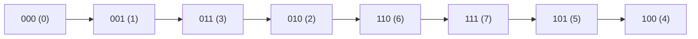

## Minimum One Bit Operations to Make Integers Zero

## Conceptos previos (breves definiciones)

- Representación binaria: cualquier entero se representa como una secuencia de bits (0/1). LSB = bit menos significativo (posición 0), MSB = bit más significativo (posición mayor).
- Operaciones bitwise básicas:
  - XOR (^) — devuelve 1 cuando los bits son distintos; útil para cancelar y combinar diferencias.
  - Shift right (>>) — desplaza bits hacia la derecha, equivalente a dividir por 2 descartando el LSB.
  - Flip / toggle — cambiar 0⇄1 en posiciones de bits.
- Prefijo de bits: los bits desde la posición i hacia arriba (todos los bits con índice ≥ i). "Flip de un prefijo" = invertir ese bit y todos los superiores.
- Gray code: una codificación binaria donde números consecutivos difieren en exactamente un bit. Propiedad clave: cambiar un prefijo de bits se relaciona con la construcción/reflejo de Gray code.
- Conversión Gray → Binary: se puede obtener el valor binario acumulando xor de desplazamientos sucesivos del código Gray (ej.: result = g ^ (g>>1) ^ (g>>2) ...).

## Enunciado

Dado un entero n, debes transformarlo en 0 usando la siguiente operación cualquier cantidad de veces:

- Elige un entero i ≥ 0 tal que el bit i-ésimo de n sea 1.
- Cambia (flip) el bit i-ésimo y todos los bits superiores (bits j ≥ i).  
  Devuelve el número mínimo de operaciones necesarias para transformar n en 0.

> Nota: en esta explicación trabajamos desde la intuición Gray-code. El enunciado y la solución están alineados con la implementación habitual (resultado = conversión Gray→binary por xor acumulado).

## Intuición: relación con Gray code

- Gray code (reflejo binario) es una codificación donde números consecutivos difieren en un solo bit.
- La operación del problema cambia un prefijo de bits; cuando recorres números en orden Gray cada paso cambia exactamente un bit (es equivalente a movernos por prefijos adecuados).
- Observación clave: si interpretamos n como si fuera un código Gray, el número mínimo de operaciones para llevarlo a 0 es equivalente a convertir ese Gray code al número binario correspondiente (es decir, calcular el "inverso" de Gray).
- Implementación práctica y eficiente: iterar desplazando n a la derecha y xor-eando en un acumulador:
  - result = 0
  - while n > 0: result ^= n; n >>= 1
  - return result

## Secuencia concreta de flips (visual)

En vez de tratar de derivar índices i con notación formal que depende de orientación de bits, mostramos la secuencia de estados (que corresponde 1:1 a las operaciones mínimas aplicadas en el orden adecuado):

- Para n = 3:

  - 11 → 01 → 00 (2 operaciones)

- Para n = 6:
  - 110 → 010 → 011 → 001 → 000 (4 operaciones)

---

## Demostración (por qué XOR acumulado = conversión Gray → binary)

Idea simple y legible:

- Sea g el número en formato Gray. La relación entre Gray (g) y su índice/binary (b) es:
  - La representación Gray se define como g = b ^ (b >> 1).
- Queremos obtener b dado g (invertir Gray). Existe una fórmula recurrente:
  - b_k = g_k (el bit más significativo coincide)
  - b*{k-1} = b_k ^ g*{k-1}
  - ...
  - En general b = g ^ (g>>1) ^ (g>>2) ^ ...
- Implementación simple: acumular XOR de g, g>>1, g>>2, ... hasta 0 produce exactamente b.
- Nuestro algoritmo hace result ^= n; n >>= 1 repetidamente, equivaliendo precisamente a esa suma de términos g ^ (g>>1) ^ (g>>2) ^ ... y por tanto devuelve b, la posición en la secuencia Gray.

Pequeña verificación algebraica:

- Si b = g ^ (g>>1) ^ (g>>2) ... entonces:
  - b ^ (b>>1) = g (se puede comprobar bit a bit por la relación recursiva arriba), por lo que la inversión es correcta.

---

## Diagramas (Mermaid)

Gray sequence (3 bits, ordenGray):



Evolución del xor-acumulado (ejemplo n=6):

```mermaid
flowchart LR
  Start[(start) n=6]
  step1["result = 0 ^ 6 = 6"]
  step2["result = 6 ^ 3 = 5"]
  step3["result = 5 ^ 1 = 4"]
  End["finish → 4 (answer)"]

  Start --> step1 --> step2 --> step3 --> End
```

---

## Enfoque algorítmico (resumen)

1. Caso base: si n === 0, devolver 0.
2. Mantener un acumulador `result = 0`.
3. Mientras n > 0:
   - result ^= n
   - n >>= 1
4. Devolver result.

Razonamiento: el xor acumulado implementa la conversión Gray → binary; ese resultado es la posición en la secuencia Gray y coincide con el número mínimo de operaciones.

## Complejidad

- Tiempo: O(log n) — iteramos por el número de bits de n.
- Espacio: O(1) — uso constante adicional.

## Notas y observaciones

- La explicación más intuitiva es pensar en la secuencia Gray: cada operación mueve un paso en esa secuencia; la posición de n en la secuencia coincide con el número mínimo de operaciones.
- El algoritmo no simula flips individuales explícitos; calcula directamente la posición en Gray usando xor acumulado (compacto y eficiente).
- Si quieres puedo añadir un ejemplo paso a paso mostrando los índices i concretos para cada flip con la convención de índices que prefieras (LSB=0 o MSB=0).